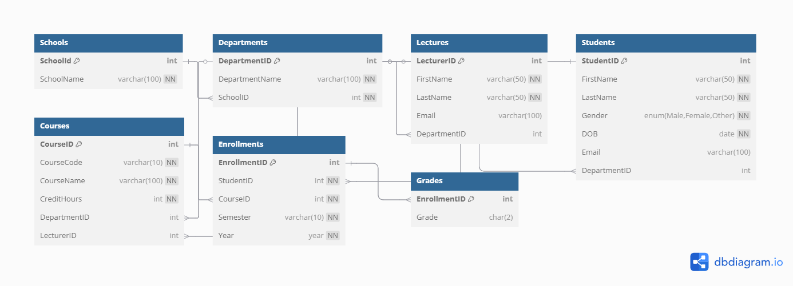

# 🎓 University Database Management System (MySQL)

## 📘 Description

This project is a fully structured **School-Based University Database** built using **MySQL**, designed to manage the core academic and administrative components of a university. It models entities such as **Schools**, **Departments**, **Students**, **Courses**, **Lecturers**, **Enrollments**, and **Grades** with appropriate relationships and constraints.

---

## ⚙️ Features

- Normalized relational structure with **PKs**, **FKs**, **NOT NULL**, and **UNIQUE** constraints
- Covers **1-to-1**, **1-to-Many**, and **Many-to-Many** relationships
- Suitable for managing:
  - Academic departments
  - Students & lecturers
  - Course enrollment and grading

---

## 🛠️ Technologies Used

- MySQL (Structured Query Language)
- ERD (Entity Relationship Diagram)

---

## 📂 Project Structure

- `University.sql` – Main SQL file with all table definitions and constraints
- `README.md` – Project documentation


---

## ▶️ How to Run

### Prerequisites:
- MySQL installed
- MySQL server running
- A terminal or command prompt

### Steps:

1. Open your terminal
2. Log in to MySQL:
   ```bash
   mysql -u root -p
3. Exit if inside the MySQL shell:
   ```bash
   exit;
4.  Navigate to the folder with your SQL file and run:
   ```bash
   mysql -u root -p < University.sql
```

5.Inside MySQL shell:
 ```bash
SHOW DATABASES;
USE UniversityDB;
SHOW TABLES;
```
###  ERD (Entity Relationship Diagram)



